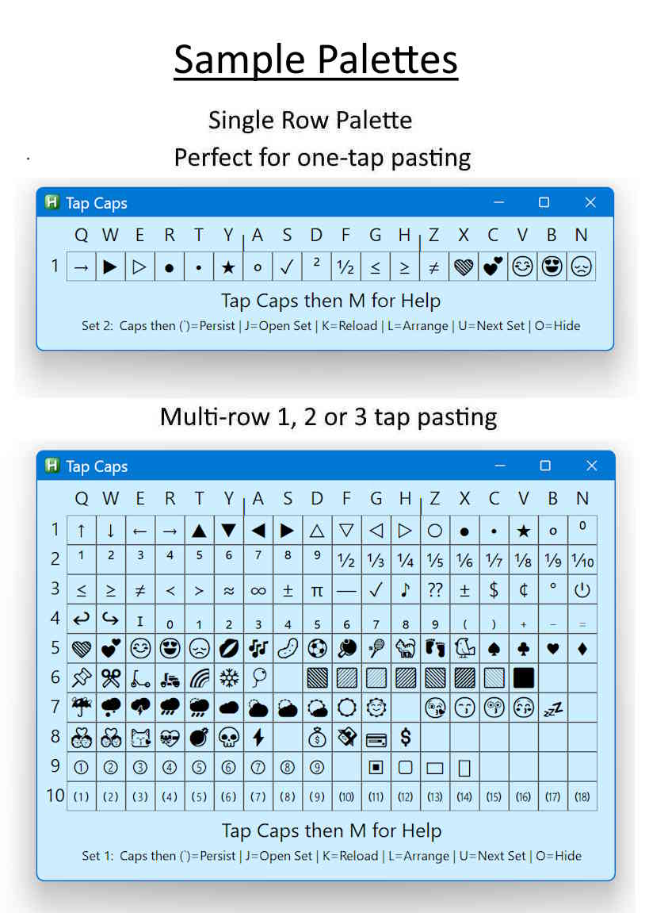

# Tap Caps — Overview

Tap Caps is a small, fast utility for inserting your favorite symbols, emojis, and special characters from your own palette into any text box. Press a hotkey, tap a quick sequence, or click a character — Tap Caps pastes it instantly.

Tap Caps also includes a fast quick‑tap sequence method that’s often quicker than navigating the mouse.

**Tap Caps is a Windows‑only utility, designed for speed, simplicity, and everyday use.**

---

## First‑Run Setup

- Run **TapCapsHotkeyToggle.exe** to enable the hotkey.  
- Now press the hotkey in any text box to open Tap Caps instantly.

---

## Quick Start (Try This First)

- If you haven’t already, run **TapCapsHotkeyToggle.exe**.  
- Open any app with a text box and place the cursor.  
- Press **Caps+A** to open Tap Caps.  
- Click any character or emoji, or use a quick‑tap sequence.

Tap Caps pastes the character into your text.  
Tap Caps stays open for multi‑symbol pasting or palette editing.

---

## Files Included

- **TapCaps.exe** — The main Tap Caps tool  
- **TapCaps.ini** — The configuration file 
- **TapCapsHotkey.exe** — Hotkey helper  
- **TapCapsHotkeyToggle.exe** — Hotkey helper installer  
- **SymbolSet1.txt** — One row set of characters and emojis  
- **SymbolSet2.txt** — Full set of characters and emojis  
- **SymbolSet3.txt** — Dummy set with just a message  
- **TapCapsHelp.txt** — Full details; Tap Caps opens this help file

Click the Tap Caps Release button on the right side of the screen for the download zip.

---

## License  
Free for personal use.
